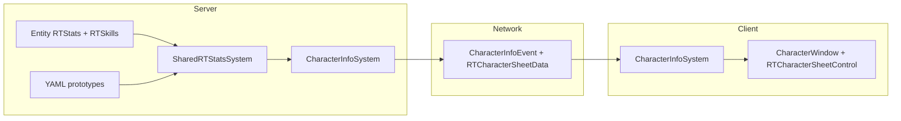

# RedTruce RPG: Stats, Skills & Character Sheet

This document describes the **implemented** RedTruce stats/skills system: data model, server resolution, networking, character menu UI, YAML, and debug tooling. It is written for designers, programmers, and anyone integrating future features (dice, curses, character creation).

---

## 1. Goals & principles

| Principle | Implementation |
|-----------|------------------|
| **Server authority** | All numbers on the sheet and all resolver APIs run on the **server**. The client only displays snapshots. |
| **Baseline vs effective** | Each stat/skill stores **Baseline** (innate / long-term) and **Current** (effective value used for rolls and “effective” UI). When nothing modifies an entity, `Current` can equal `Baseline`; systems such as curses or buffs may change **only** `Current`. |
| **Single resolver** | Gameplay and UI both go through `SharedRTStatsSystem` (`TryGetStat`, `TryGetSkillCategory`, `TryGetSkillSpecialization`, `GetSkillDiceContribution`, `BuildCharacterSheet`) so behavior stays consistent. |
| **Fallbacks** | Mobs without full YAML still get sensible values via species defaults → global prototype → hardcoded constants. |
| **RedTruce isolation** | Core types live under `Content.Shared/_RedTruce/` (namespace `Content.Shared._RedTruce`) and `Content.Server/_RedTruce/`. **Vanilla** is touched only where the character-info pipeline already existed (`CharacterInfoEvent` carries `RTCharacterSheetData`). |
| **Fork prefix (RT)** | Serializable types, components, and prototype **kinds** / **ids** use the **RT** prefix so they do not collide with upstream or other forks. Species defaults are matched by the **`species`** field (`ProtoId<SpeciesPrototype>`), not by making the prototype `id` equal to the species id (so ids like `RTSpeciesHuman` are safe). |

---

## 2. High-level architecture



1. **Entity** holds per-mob `RTStatsComponent` / `RTSkillsComponent` (dictionaries keyed by prototype IDs).
2. **Prototypes** define stat IDs, skill categories, specializations, species defaults, and global fallbacks.
3. **Resolver** reads entity → species → global → constants.
4. **Character info** request builds one `RTCharacterSheetData` and sends it with the existing character menu payload.
5. **Client** renders the sheet; it does **not** recompute pools.

---

## 3. Data model (ECS)

### 3.1 `RTStatsComponent`

- **Path:** `Content.Shared/_RedTruce/Rpg/RTStatsComponent.cs`
- **YAML component type:** `RTStats`
- **Storage:** `Dictionary<ProtoId<RTStatPrototype>, RTStatValue> Stats`
- **`RTStatValue`:** `Baseline` (int), `Current` (int) — both required in YAML/serialization.
- **Networking:** Not networked as state sync; the client does not need live component replication for V1 (sheet comes from `CharacterInfoEvent`).

### 3.2 `RTSkillsComponent`

- **Path:** `Content.Shared/_RedTruce/Rpg/RTSkillsComponent.cs`
- **YAML component type:** `RTSkills`
- **Storage:**
  - `Categories`: `Dictionary<ProtoId<RTSkillCategoryPrototype>, RTStatValue>`
  - `Specializations`: `Dictionary<ProtoId<RTSkillSpecializationPrototype>, RTStatValue>`
- Same baseline/current pattern as stats.

### 3.3 Stat prototype (`rtStat`)

- **Path:** `Content.Shared/_RedTruce/Rpg/RTStatPrototype.cs`
- **YAML kind:** `rtStat`
- **Fields:** `id` (use **RT**-prefixed ids, e.g. `RTStrength`), `ordering` (sort in UI), `nameLocId` (Fluent key for display name).

### 3.4 Skill category (`rtSkillCategory`)

- **Path:** `Content.Shared/_RedTruce/Rpg/RTSkillCategoryPrototype.cs`
- **YAML kind:** `rtSkillCategory`
- **Fields:** `id`, `ordering`, `nameLocId`, `linkedStat` (which `rtStat` ID feeds the dice pool for this category).

### 3.5 Skill specialization (`rtSkillSpecialization`)

- **Path:** `Content.Shared/_RedTruce/Rpg/RTSkillSpecializationPrototype.cs`
- **YAML kind:** `rtSkillSpecialization`
- **Fields:** `id`, `ordering`, `nameLocId`, `category` (parent `rtSkillCategory` ID).

### 3.6 Species defaults (`rtSpeciesStatsDefaults`)

- **Path:** `Content.Shared/_RedTruce/Rpg/RTSpeciesStatsDefaultsPrototype.cs`
- **YAML kind:** `rtSpeciesStatsDefaults`
- **Purpose:** Default stat/skill blocks for a species. **`species`** must match the `SpeciesPrototype` id (e.g. `Human`). The prototype **`id`** is arbitrary (e.g. `RTSpeciesHuman`); the resolver finds the row by **`species`**, not by `id == species`.
- **Fields:** `species`, `stats`, `skillCategories`, `skillSpecializations` (same value shape as on components).

### 3.7 Global fallback (`rtGlobalFallback`)

- **Path:** `Content.Shared/_RedTruce/Rpg/RTGlobalFallbackPrototype.cs`
- **YAML kind:** `rtGlobalFallback`
- **Singleton id:** `RTGlobalFallback` (constant `SharedRTStatsSystem.GlobalFallbackId`).
- **Purpose:** Anonymous mobs / missing species rows still resolve every known stat/category/spec key.

---

## 4. Resolver behavior (`SharedRTStatsSystem`)

**Path:** `Content.Shared/_RedTruce/Rpg/SharedRTStatsSystem.cs`

### 4.1 `TryGetStat(uid, statId, out effective, out baseline)`

Resolution order:

1. Entity `RTStatsComponent.Stats[statId]` → `effective = Current`, `baseline = Baseline`
2. Else if humanoid → `rtSpeciesStatsDefaults` whose **`species`** matches → same fields from YAML
3. Else `rtGlobalFallback` → same
4. Else hardcoded **10** / **10** (`HardcodedFallbackStat`)

### 4.2 `TryGetSkillCategory` / `TryGetSkillSpecialization`

Same chain: **entity component → species defaults → global fallback → 0 / 0** (`HardcodedFallbackSkill`).

### 4.3 `GetSkillDiceContribution(uid, categoryId, specializationId?)`

Returns `RTStatDiceBreakdown(StatPart, CategoryPart, SpecPart)`:

| Part | Source |
|------|--------|
| **StatPart** | Linked stat’s **effective** value (`Current` via `TryGetStat`) for that category’s `linkedStat` |
| **CategoryPart** | Category’s **effective** rating (`Current` via `TryGetSkillCategory`) |
| **SpecPart** | If a specialization is passed, its **effective** rating; otherwise `0` |

**Important:** All three contributions use **`Current`**, not `Baseline`. That is how curses/buffs on stats or skills change pools without changing baseline on the sheet.

### 4.4 Map init merge

On `MapInitEvent`:

- **`RTStatsComponent`:** For each entry in species defaults’ `stats`, if the entity’s dictionary **does not** already contain that stat key, insert the default value.
- **`RTSkillsComponent`:** Same for `skillCategories` and `skillSpecializations`.

Entity YAML (or prior edits) **wins** for keys that already exist; defaults only **fill gaps**. Species is read from `HumanoidProfileComponent.Species`.

---

## 5. Character sheet payload & formulas

**Path:** `Content.Shared/_RedTruce/Rpg/RTCharacterSheetData.cs`

### 5.1 Network types

- **`RTCharacterSheetData`:** `Stats` + `SkillCategories` (lists).
- **`RTStatSheetEntry`:** `StatId`, `Baseline`, `EffectiveDicepool`  
  - Here **EffectiveDicepool** is the stat’s **effective numeric value** (`Current`) for display in the “Effective dicepool” column on the **Stats** block (naming is historical; it is not a multi-term “pool” for raw stats).
- **`RTSkillCategorySheetEntry`:** category id, linked stat id, `CategoryBaseline`, `CategoryEffectiveDicepool`, **`DicepoolStatPart` / `DicepoolCategoryPart`** (attribute + category **current** contributions for the category row tooltip), list of specs.
- **`RTSkillSpecSheetEntry`:** `SpecId`, `SpecBaseline`, `SpecEffectiveDicepool`, plus **`DicepoolStatPart` / `DicepoolCategoryPart` / `DicepoolSpecPart`** for spec-row tooltips.

### 5.2 `BuildCharacterSheet(uid)` (server)

**Stats (one row per `rtStat` prototype, sorted by `ordering`, then id):**

- Baseline column = resolver `baseline`
- Effective column = resolver `effective` (`Current`)

**Skill categories (sorted by linked stat’s ordering, then category ordering, then id):**

- **Group headers in UI** are derived client-side when `LinkedStatId` changes (e.g. “Strength — linked skills”).
- **Category row:**
  - Baseline = category `Baseline`
  - Effective dicepool = **sum** of `GetSkillDiceContribution(uid, categoryId, null)` → `StatPart + CategoryPart + SpecPart`  
  - With no spec, this is **linked stat effective + category effective**.

**Specialization rows (every spec under that category):**

- Baseline = spec `Baseline`
- Effective dicepool = **sum** of `GetSkillDiceContribution(uid, categoryId, specId)`  
  - = **linked stat effective + category effective + spec effective**

All specialization prototypes are listed (including zeros), so the sheet is a full reference.

---

## 6. Networking & vanilla integration

### 6.1 Events

| Event | Role |
|-------|------|
| `RequestCharacterInfoEvent` | Client → server: “refresh my character panel for this net entity.” |
| `CharacterInfoEvent` | Server → client: job, objectives, briefing, **`RTCharacterSheetData RTSheet`**. |

**Path (shared):** `Content.Shared/CharacterInfo/SharedCharacterInfoSystem.cs`

### 6.2 Server handler

**Path:** `Content.Server/CharacterInfo/CharacterInfoSystem.cs`

After existing job/objectives/briefing logic:

```csharp
var rtSheet = _rtStats.BuildCharacterSheet(entity);
RaiseNetworkEvent(new CharacterInfoEvent(..., rtSheet), args.SenderSession);
```

Security: only the session whose **attached entity** matches the requested net entity receives the event (unchanged vanilla check).

### 6.3 Client

**Path:** `Content.Client/CharacterInfo/CharacterInfoSystem.cs`

- `CharacterData` includes `RTCharacterSheetData RTSheet`.
- `OnCharacterInfoEvent` builds `CharacterData` and raises `OnCharacterUpdate`.

**Path:** `Content.Client/UserInterface/Systems/Character/CharacterUIController.cs`

- On update, calls `_window.RTSheet.SetData(rtSheet)`.
- Opening the character menu still triggers `RequestCharacterInfoEvent` (one round trip).

---

## 7. User interface

### 7.1 Window shell

**Path:** `Content.Client/UserInterface/Systems/Character/Windows/CharacterWindow.xaml`

- Embeds `RTCharacterSheetControl` (`Content.Client/_RedTruce/Character/Controls/`).
- Wider min width (~560px), scroll container with horizontal expand so the sheet uses available width.

### 7.2 `RTCharacterSheetControl`

**Path:** `Content.Client/_RedTruce/Character/Controls/RTCharacterSheetControl.cs`

- **Layout:** Each **row** is a horizontal `BoxContainer` with three cells: label | baseline | effective/dicepool. That keeps headers aligned with columns when the window is resized (first column uses `HorizontalExpand`).
- **Stats block:** Section title + header row + one row per stat.
- **Skills block:** Section title + for each linked-stat group: subtitle (`{ stat } — linked skills`) + table with header row + category rows + indented `•` spec rows.
- **Typography:** Headers use `LabelSubText`; body uses default/`LabelKeyText` for category names; baseline numbers `LabelWeak`; effective/dicepool `Highlight` — same nominal font size for alignment.
- **Display names:** Resolved on the client via `IPrototypeManager` using each prototype’s `nameLocId`, so **fork-prefixed ids** (e.g. `RTStrength`) do not require duplicate Fluent keys keyed by id.
- **Effective dicepool tooltips:** Hover the **effective dicepool** number. **Stats** show the baseline contribution in green (`+N` stat name `(Baseline)`), a short note when effective equals baseline, and—when they differ—an aggregate delta line for other modifiers (per-modifier detail later). **Skills** show `+attr (Name) + category (Name)` on category rows and add `+ spec (Name)` on specialization rows; all terms use **current** values and match `GetSkillDiceContribution`.

### 7.3 Localization

**Paths:**

- `Resources/Locale/en-US/_RedTruce/character-sheet.ftl` — sheet column headers, group line, **dicepool tooltip** strings (`rpg-sheet-tooltip-*`); stat/skill display names via prototype `nameLocId` (e.g. `rpg-stat-strength`, `rpg-skill-cat-melee`).
- `Resources/Locale/en-US/_RedTruce/commands.ftl` — debug command strings.

---

## 8. YAML layout (content)

| File (under `Resources/Prototypes/_RedTruce/`) | Contents |
|--------------------------------------------------|----------|
| `rpg_stats.yml` | All `rtStat` definitions (ids like `RTStrength`) |
| `rpg_skills.yml` | `rtSkillCategory` + `rtSkillSpecialization` |
| `rpg_species_human.yml` | `rtSpeciesStatsDefaults` for `species: Human` (`id: RTSpeciesHuman`, …) |
| `rpg_global_fallback.yml` | `rtGlobalFallback` with `id: RTGlobalFallback` |

**Entity wiring example:** `Resources/Prototypes/Body/species_base.yml` — `BaseSpeciesMobOrganic` includes `RTStats` and `RTSkills` (may use empty maps; MapInit merges species defaults for humanoids).

---

## 9. Debug: `rpg_randomize`

**Path:** `Content.Server/_RedTruce/Commands/RedTruceRpgRandomizeCommand.cs`

| Property | Value |
|----------|--------|
| Command | `rpg_randomize` |
| Access | `[AdminCommand(AdminFlags.Debug)]` |
| Target | Caller’s `AttachedEntity` |

**Behavior:**

- **Stats:** Clears and repopulates every `rtStat` key. **Random baseline** in **6–18**; **`Current` is set equal to `Baseline`** so the sheet shows matching columns until something else changes `Current` (e.g. future curse system).
- **Skills:** Clears categories and specializations; each gets a random rating **0–3** with **`Baseline == Current`** (good for checking dicepool = stat + cat + spec using visible numbers).

**Note:** Do **not** call `Dirty()` on these components — they are not networked components; the client refreshes by reopening the character menu (new `CharacterInfoEvent`).

---

## 10. Extension points (not yet implemented)

| Feature | Suggested approach |
|---------|---------------------|
| **Curses / buffs on stats** | Systems update only `RTStatValue.Current` (or skills’ `Current`). Resolver and sheet already read `Current` for effective column and dice terms. |
| **Dice engine** | Call `TryGetStat` / `GetSkillDiceContribution` from server-side roll logic; avoid duplicating fallback rules. MVP resolver lives in `Content.Shared/_RedTruce/Rpg/Dice/RTDicePoolResolver.cs`. |
| **Dicetricks (deferred)** | Placeholder contract exists now (`RTDiceTrickSpec`, `RTDiceTrickKind`) via `Content.Shared/_RedTruce/Rpg/Dice/RTDiceTrickSpec.cs`. `RTDiceRollSpec.DiceTricks` is present but ignored in MVP. Implement ordered trick execution at the explicit TODO hook in `RTDicePoolResolver.Roll`. |
| **Pre-roll situational gather (deferred)** | Gather ultra short-lived context right before roll (darkness, cover posture, transient stance) and adjust pool/TN. Explicit TODO hook exists in `Content.Server/_RedTruce/Commands/RedTruceRpgRollSkillCommand.cs` right before `RTDiceRollSpec` creation. |
| **Character creation** | Write baselines (and initial `Current`) onto a new mob’s components; same prototypes and resolver. |
| **More species** | Add `rtSpeciesStatsDefaults` prototypes with correct **`species`** field for each `SpeciesPrototype`. |
| **Networking components** | Only if you need live UI outside the character menu without a new request; would require `[NetworkedComponent]` and sync rules. |

---

## 11. Quick file index

| Area | Path |
|------|------|
| Stats component | `Content.Shared/_RedTruce/Rpg/RTStatsComponent.cs` |
| Skills component | `Content.Shared/_RedTruce/Rpg/RTSkillsComponent.cs` |
| Resolver + sheet build | `Content.Shared/_RedTruce/Rpg/SharedRTStatsSystem.cs` |
| Sheet DTOs | `Content.Shared/_RedTruce/Rpg/RTCharacterSheetData.cs` |
| Dice breakdown struct | `Content.Shared/_RedTruce/Rpg/RTStatDiceBreakdown.cs` |
| Dice roll spec/result/resolver | `Content.Shared/_RedTruce/Rpg/Dice/` |
| Dicetrick placeholder contract | `Content.Shared/_RedTruce/Rpg/Dice/RTDiceTrickSpec.cs` |
| Character info contract | `Content.Shared/CharacterInfo/SharedCharacterInfoSystem.cs` |
| Server CI + sheet | `Content.Server/CharacterInfo/CharacterInfoSystem.cs` |
| Client CI + `CharacterData` | `Content.Client/CharacterInfo/CharacterInfoSystem.cs` |
| Character window + controller | `Content.Client/UserInterface/Systems/Character/` |
| Sheet control | `Content.Client/_RedTruce/Character/Controls/RTCharacterSheetControl.cs` |
| Debug command | `Content.Server/_RedTruce/Commands/RedTruceRpgRandomizeCommand.cs` |
| Skill roll debug command + situational hook | `Content.Server/_RedTruce/Commands/RedTruceRpgRollSkillCommand.cs` |

---

## 12. Glossary

| Term | Meaning |
|------|---------|
| **Baseline** | Long-term or “sheet” value; shown in the Baseline column; stored as `RTStatValue.Baseline`. |
| **Effective** | Value used for mechanics; stored as `RTStatValue.Current`; resolver exposes it as `effective` out-parameter. |
| **Effective dicepool (skills)** | Sum of linked stat effective + category effective (+ spec effective for spec rows). |
| **Effective dicepool (stats row)** | UI label for the second numeric column; value is the stat’s **effective** (`Current`), not a separate pool formula. |

---

*Document version: matches repository implementation as of authoring. Update this file when adding dice rolls, replication, or new UI surfaces.*
